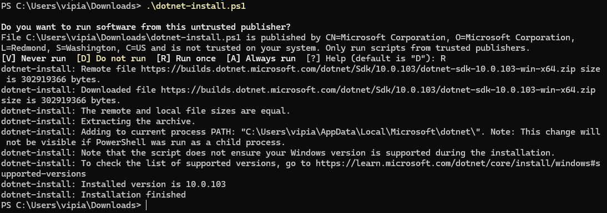
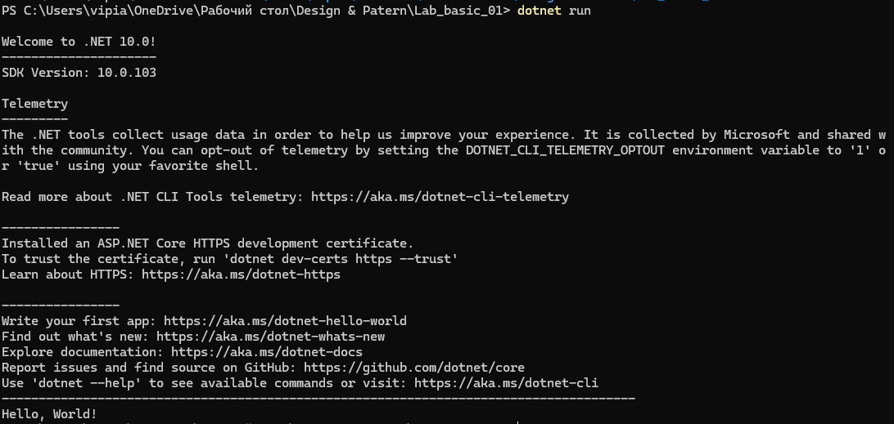
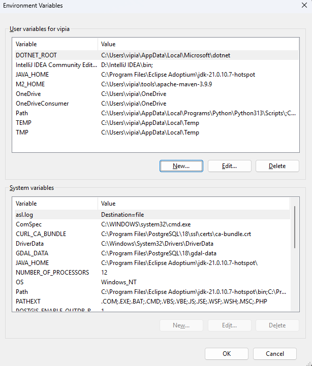

# Отчёт по запуску первого .NET приложения

## 1. Установка .NET SDK
На этом этапе был установлен .NET SDK.



## 2. Запуск первого приложения
После установки выполнен запуск первого консольного приложения (`dotnet run`), в результате получен вывод `Hello, World!`.



## 3. Проверка dotnet new console
Проверка (`dotnet new console`).


## 4. Настройка Environment Variables
В переменные окружения добавлены пути для корректной работы `dotnet` из терминала.




## Код проекта

### `Program.cs`
```csharp
using System;

Console.WriteLine("Hello, World!");
```

### `myproject.csproj`
```xml
<Project Sdk="Microsoft.NET.Sdk">
  <PropertyGroup>
    <OutputType>Exe</OutputType>
    <TargetFramework>net10.0</TargetFramework>
  </PropertyGroup>
</Project>
```
