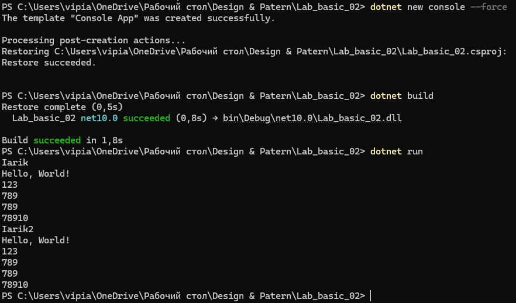

# Lab basic 02

## Концепты
- Артефакты компиляции
- Папки `bin` и `obj`
- Исходный код
- Инструкции (statements) программы
- Порядок выполнения инструкций
- Функции для группировки нескольких инструкций

## 1. Компилирование и выполнимый файл
- При очистке артефактов (аналог удаления `bin` и `obj`) команда `dotnet run --no-build` падает с ошибкой:
`The system cannot find the file specified` для `bin/Debug/net10.0/Lab_basic_02.exe`.
- Причина ошибки: флаг `--no-build` запрещает сборку, а готового `.exe` в `bin` нет.
- После `dotnet build` артефакты создаются заново.
- Основные файлы после сборки:
`Lab_basic_02.exe`, `Lab_basic_02.dll`, `Lab_basic_02.deps.json`, `Lab_basic_02.runtimeconfig.json`.
- Папки:
`bin` - готовые файлы для запуска.
`obj` - промежуточные файлы сборки и кэш компиляции.
- Запуск через консоль:
```powershell
.\bin\Debug\net10.0\Lab_basic_02.exe
```
- Почему окно закрывается при двойном клике:
программа завершается, и консольное окно сразу закрывается.



## 2. Базовые инструкции и функции
- В консоль выводится строка `Hello, Jerry`.
- Есть функция `Hello1()`, которая печатает:
`A`, `B`, `C`.
- `Hello1()` вызывается 3 раза, между вызовами есть задержка `Thread.Sleep(500)`.
- Созданы отдельные функции `A()`, `B()`, `C()` и выполняются в основной программе.
- Если функцию не вызвать (например, `NOFUNC()`), она не выполнится. Компилятор показывает предупреждение о неиспользуемой функции (`CS8321`).
- Порядок определения функций в файле не критичен: можно вызывать функцию, определенную ниже по коду.

## Что такое определение функции
Определение функции - это блок кода, где задаются ее имя и инструкции, которые выполнятся при вызове.

Пример:
```csharp
A(); // вызов

void A() // определение
{
    Console.WriteLine("Hello");
}
```
